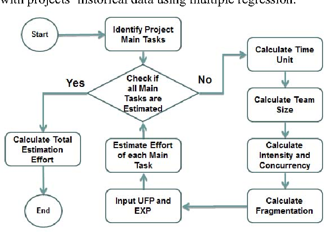
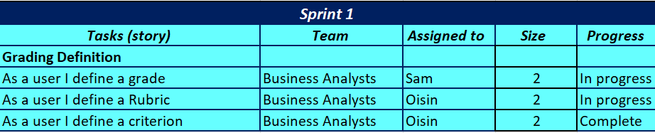
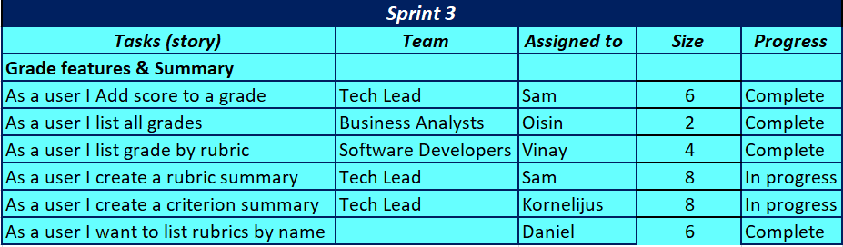
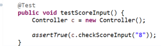
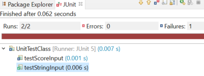
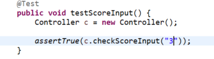
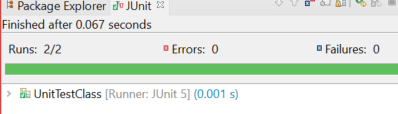
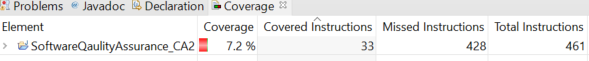
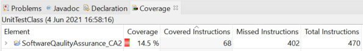

# SoftwareQaulityAssurance_CA2
***
#Demonstrating Software Quality - CA2 - Sofware Quality Assurance - Vinay Kumar 

***
###Contents 

* **Sprint Backlog and Task estimation**
    * Effective Sprint backlogging 
    * Spribt backlog for project 
    * Velocity 
* **Unit Testing and Test-Driven Development**
    * Test Driven Development 
    * Unit testing and examples
* **Code Coverage Metric**
    * Code Coverage
    * Benefits of Code Coverage 
    * Coverage demonstrated in project 
* **Team Version Control**
    * Version COntrol
    * Gitflow
    *Branching and Gitflow in project 
* **Code Review Checklist**
    * Code Review
    * Approaches
    * Code Review Checklist 
* **References**

***

### Overview 

This reference guide will explore best practices of agile software development. It will provide an example of applying the practices in a software project and demonstrate the benefits of these practices in the following topics using the Scrum methodology.

1. Scrum sprint backlog and task estimation 
2. Unit testing and test-Driven Development 
3. Test coverage metric 
4. Team version-control
5. Code-review checklist

  

---

### (1) Scrum sprint backlog and Task Estimaton 

When undertaking new software projects, it is essential to list or outline tasks, goals and features in order accurately predict or measure the time effort and manpower required to complete these goals or objectives. 

In agile development workflow a sprint backlog is developed when your team estimates all tasks that are associated with user stories in quantification of time and effort. The sprint backlog is essentially a list of items teams should complete in a sprint. The practice of creating the sprint backlog results in a shared team perspective, resulting in a task estimation process that is consistent and reliable throughout all sprints. 
it is an essential part of any Agile project during planning so that the team breaks the tasks down into steps 

##### Creating an effective sprint backlog
An effective sprint backlog process must: 
* Contain all tasks and user stories to be addressed during the sprint 
* Have realistic evaluations made by all team members to accurately predict a pace
* Have shared decisions with all team members taking part to diversify perspectives 
* allow for team members to assign tasks to one another, collaborate and promote   communication
* Have continuous updates on regular basis to know where you team and tasks stand
 

 

##### Sprint Backlog

 

 

 

* Here we can see that we have clearly identified our tasks for the project. Dispersing our tasks over three sprints in which we have allocated teams per task as well as certain individuals responsible for the task. this is for show as an example of the teams involvement in the sprint backlog as i am working alone on this project. We can also see a Size rating or in other words the difficulty estimate of the task and the status of the task or the tasks progress. Following the end of a sprint their is generally a sprint retrospective in order for teams to assess their sprints and make any changes. 

* The estimation of the effort required in terms of difficulty level is measured and decided by the whole team. Here we can see in our sprints that the estimates go in values of 2 increasing with difficulty as 2 is the lowest difficulty level and 10 being the highest. Based of past project experience, examination of feature, requirements and complexity the team can base their difficulty estimate in many ways. Here I have chosen to place a numerical value on the estimate in order for the team to rate their tasks in terms of their perceived difficulty in increments of 2 allowing for some leeway if estimates fall in between increments. 
 
 
For example we can see how the difficulty estimates vary in sprint 2 as creating a rubcric is thought to be simpler than creating and displaying a list of rubrics by name. Here creating a rubric involves defining the object and instantiating it while he rubric by name involves searching through rubcrics in terms of a name returning incorrect until the chosen name is found.

We can also see that a task from sprint2 with a significant difficulty level has not been completed therefore moving the task to sprint 3. The movement of the task will affect the velocity estimates by the time but this is an example of how a team may not realise the extent of a feature before undertaking the task itself. 

##### Velocity 
velocity in Agile is used as a measure how much work can be completed in each sprint. It is widely used as a tool to help  teams create accurate and efficient time lines.It is not meant to be a benchmark as it varies from teams own interpretation of it's measurement. Simply put it's meant to be used as a planning tool for better accuracy in determining the time frame of sprints.

It is measured by units of work completed in a given timeframe. For example most scrum teams would measure the number of given story points in a sprint adding them up and then using the figure based off a few sprint totals to predict how many sprints it will take to complete a project or accurately predict a timeframe for project completion. 

A common mistake in Agile that is made is using velocity as a measure of efficiency. Lower velocity numbers are seen as being attributed to corners being cut and leading to inefficiencies. A team should try maintain a steady number in order to reduce pressure on developers and not promote corner cutting to achieve lower velocity goals. 

***

### (2) Unit testing and test Driven Development 

##### Test Driven Development (TDD)
Test Driven Development is an approach to software development where test cases are developed to specify and validate the code created. Cases arcreated for each functionality and if a test fails then new code is added or code is rewritten to pass the test and elimate bugs. 

The concept is to write and correct tests that have failed in order to elimate bugs and limit duplication of code tests are done on small code blocks at a time. To perform a TDD test the following steps are done 
 

1. Add a test case 
2. Run tests to see if any fail
3. Write some code
4. Run tests and then refactor code if necessary
5. Repeat until all tests pass

##### Unit testing 
Unit testing is where individual blocks of code in software are tested to validate its expected performance. Verifying its correctness, usually done by a developer using software tools. 

In this project I used the JUnit tool in eclipse in order test out the code I wrote. Below is the demonstration of my unit test process. I'll look at the validation tests of input from a user.

The input expected is to be a mark between 1 and 5
  
* **failed test** - We can see the value entered of 8 is not between 1 and 5 so the test fails producing an error seen in the 2nd image. this allowed me as a developer to see the error and go back to correct the input if needs be

 
 

  

* **Success** - We can then see the changes I made in my input as the user enters a number between 1 and 5 and the Unit test returns a successful result for this block of code. 

  

 

 

***

### (3) Test Coverage Metric

##### Code Coverage 
* A metric to help understand how much of your source code is tested. It's useful to asses the quality of your test suite to determine how your code was exercised or not excercised by the test suite. Code coverage is one such software testing metric that can help in assessing the test performance and quality aspects of any software.

######Benefits of code coverage
* **Easier maintenance of code base** -  ensure code quality is well-maintained and new features can be added with little-to-no efforts.

* **Exposing poor code** - understand bad, dead, and unused code leading to better practices and improed quality

* **Faster to market** - Speeds up development time increasing productivity and efficiency 
 

* code coverage tools help calculate a metric that quantifies the coverage of tests in relation to all the code written in a program or software. 
* code coverage is calculated by the following formula

	-Code Coverage Percentage = (Number of lines of code executed by a testing algorithm/Total number of lines of code in a system component) * 100.

* 100% code coverage doesn't necessarily imply a bug free program, it just means that they have covered the criteria requirement of the software.Coverage can be assessed in many ways

1. **Function Coverage** – The functions in the source code that are called and executed at least once.
2. **Statement Coverage** – The number of statements that have been successfully validated in the source code.
3. **Path Coverage** – The flows containing a sequence of controls and conditions that have worked well at least once.
4. **Branch or Decision Coverage** – The decision control structures (loops, for example) that have executed fine.
5. **Condition Coverage** – The Boolean expressions that are validated and that executes both TRUE and FALSE as per the test runs.

##### Code coverage tool used in this project 
I used eclipe's built in coverage tool. Using the same example i used from unit testing we can see how the coverage tool assesses and reports the breakdown of each class and shows the numeric value of coverage provided in each class by the Unit tests carried out. 

Here we can see this is my first unit test carried out on the users input. we can see in the image the amount of coverage that is provided by this test. The test is providing coverage for the Controller class and we can see that the coverage achieved by the 1st unit test is just over 7%. 

* **First test** 

We can then see below the introduction of a second test in the controller class which eets the criteria of the unit test. Therefore increasing te coverage of code in the class. Code coverage then rises to short of 15%
* **Second test** 

***

### (4) Team version Control

##### Version control
* The practice of managing and monitoring changes to software code. Version control helps software teams manage changed in source code over time allowing for remote collaboration.Version control tools are exceptionally useful for DevOps teams and reduce development cycle times and increase success rates. Version control Keeps track of every change in code. Developers can reverse mistakes and return to earlier versions of the code in order reduce disruption to their team. Version control allows simultaneous collaboration on software projects in order to review code, change and write new code, fix bugs and remove conflicts. 

###### Gitflow
* Git is the most commonly used version control system. Developers can create repositories in order to store their code releases, share, contribute and collaborate. The Gitflow Workflow defines a strict branching model designed around the project release. This provides a robust framework for managing larger projects.  Gitflow is the abstract idea of a git workflow. 

The Gitflow process can be summarised in he following steps
 
1)Create a branch
2)Add commits 
3)Open a pull request
4)Review code
5)Deploy and Merge 

##### My project branches 
I have used the gitflow model in this project. I will walkthorugh the process flow for the README.md file I am currently writing. 

* I began with my repo and cloning it to my machine in order to be able to store my code changes. Starting with my main branch created automatically by the cloning process and then **1)** created new branch, the develop branch to act as my up to date release of the project. From there I moved on and created individual branches for the sections of my README file. Each branch representing a task to be completed. When writing code for one of my tasks or branches I then **2)** commit my work to the chosen branch for that particular task and push it to my repo.Commits also create a transparent history of your work that others can follow to understand what you've done and why.  

I then **3) & 4)** open a pull request in order to review my code and receive feedback( if i was working in a group). Pull Requests initiate discussion about your commits. Anyone can see exactly what changes would be merged if they accept your request. The team reviewing your changes may have questions or comments on your commit. I then **5)** deploy from my branch before merging to my test deployment branch in develop or else to my main branch for release. 

At the time of writing I currently have 5 branches created: 
* **backlogAndTaskEstimate** - Sprint backlog and task estimation 
* **develop** - pre release test branch 
* **main** - official release branch 
* **referenceguide** - the first commit to the file.
* **testCoverageMeteric** - Test coverage
* **versionControl** - Version Control

Once I complete the remaining branch and am completed my commits I will merge the develop branch back into the main branch in order make that the official release

- You can see from my example that I have not included the branches for the actual code yet therefore I am not able to prepare an official release as the project is not complete. However you can already see the benefit of the pull request from looking at my naming convention of the branches. A team member would be able to ask for example why it's called reference guide when there is no task associated with it, which was a naming mistake on my part due not planning out the correct breakdown of the structure of my README file and tasks but my comments on my commits may help them see what work I was committing at the time. 

As I am now finishing this section or task I will complete and commit to the versionContrl branch, open a pull request and merge to the develop branch. I will then create the final branch for the code review section.

***

### (5) Code review Checklist 

##### Code Review
 * Code reviews are the process of systematically examining team members or fellow programmers code for errors bugs and mistakes. The process has been proven to accelerate and streamline the software development cycle.  
 
##### Approaches
* **Email Thread** - Files sent via email for review  
* **Pair Programing** - Developers working in pairs on the same code
* **Over The Shoulder** - Having a colleague walk through your code with you
* **Tool Assisted** - Software based code review tools

##### Code Review Checklist
A pull request (sometimes called merge requests), is a review request. You are asking someone to check the changes on a branch before merging into another branch. This starts a code review, code reviews are based on teams own viewpoints and understanding. 

When reviewing code the following criteria is generally a well detailed example of a code review checklist and one which I intend to follow in my Java classes during this project.

1. Code Formatting - naming conventions and code alignment such as indentation and screen fit
2. Architecture - The code should follow the defined architecture and design - classes and layers  
3. Coding Best practices -  commenting of code, functioning features and performance
4. NonFunctional Requirements - Maintainability with minimum support effort, readability, testability and usability 

- [Code Review for project](https://raw.githubusercontent.com/vinayk-TUD/SoftwareQaulityAssurance_CA2/codereview/images/codereview.PNG)

***	

### References 

- [Markdown Language](https://www.markdownguide.org/basic-syntax/)
- [Task Estimation in Scrum](https://www.projectmanagement.com/blog/blogPostingView.cfm?blogPostingID=46054&thisPageURL=/blog-post/46054/Task-Estimation-with-Scrum#_=_)
- [Sprint Backlog](https://www.sealights.io/sprint-velocity/the-sprint-backlog-why-its-important-and-how-to-make-it-great/)
- [Velocity](https://www.planview.com/resources/articles/lkdc-velocity-agile/#:~:text=Velocity%20in%20Agile%20is%20a,iterations%2C%20sprints%2C%20or%20weeks.)
- [Velocity 2](https://www.agilealliance.org/glossary/velocity)
- [Coverage](https://www.codegrip.tech/productivity/everything-you-need-to-know-about-code-coverage/)
- [Coverage 2](https://www.atlassian.com/continuous-delivery/software-testing/code-coverage)
- [Version Control](https://www.atlassian.com/git/tutorials/what-is-version-control#:~:text=Version%20control%2C%20also%20known%20as,to%20source%20code%20over%20time.)
- [Gitflow](https://www.atlassian.com/git/tutorials/comparing-workflows/gitflow-workflow)
- [Gitflow 2](https://www.perforce.com/blog/vcs/what-is-version-control)
- [Gitflow 3](https://guides.github.com/introduction/flow/)
- [Code Review](https://smartbear.com/learn/code-review/what-is-code-review/#:~:text=Code%20Review%2C%20or%20Peer%20Code,like%20few%20other%20practices%20can.)
- [Unit Testing](https://www.guru99.com/unit-testing-guide.html)
- [Code Coverage](https://www.codegrip.tech/productivity/everything-you-need-to-know-about-code-coverage/)